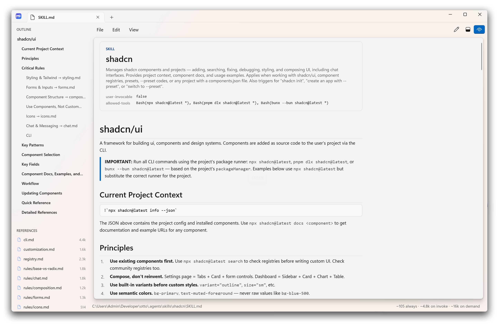

<h1 align="center">
  <br>
  MdPad
</h1>

<p align="center">
  A fast, native Markdown editor for Windows — and a purpose-built workbench for authoring <strong>agent skills</strong>.
</p>

<p align="center">
  
  
  
  
  
</p>

<p align="center">
  
</p>

---

## What it is

MdPad renders Markdown into **native WinUI controls** — no WebView2, no HTML, no Electron. A heading becomes a `TextBlock`, a table becomes a `Grid`, a code fence becomes a bordered `ScrollViewer`. Startup is instant, memory stays low, and the preview inherits your Windows theme, accent colour, and Mica backdrop for free.

It started as a Markdown previewer. It grew into a skill-authoring tool, because a `SKILL.md` is not really a document — it is **a prompt fragment loaded into an agent's context under a budget, with a strict metadata contract**. MdPad shows you that side of the file while you write it.

MdPad is free and open source under the [MIT license](LICENSE).

## Highlights

**As a Markdown editor**

- Live preview with a draggable split, or editor-only / preview-only views
- Tabs in the title bar, Windows 11 Notepad style, with per-tab caret and scroll position
- Heading outline sidebar — click to jump the preview and the caret
- A formatting toolbar whose tooltips show both the Markdown and the shortcut
- Tables, task lists, blockquotes, fenced code, strikethrough, autolinks (Markdig's advanced extensions)
- **Inline HTML** — the centred header, badge row, `<kbd>`, `<br>` and `<table>` that READMEs are built from render as native controls too

**As a skill workbench**

- **Front matter as a header card** — `name` and `description` presented properly, remaining keys as a clean metadata table
- **Context budget meter** — what the file costs an agent, split by *when* each part loads
- **Reference panel** — every linked file with its token count, click to open in a tab
- **Broken-link detection** — a link to a file that isn't there is called out inline, not silently rendered as text
- **Orphan detection** — files sitting in the skill folder that nothing links to

## The skill workbench, in detail

### Context budget

A skill enters an agent's context in three stages, and the status bar reports each one:

```
~105 always  ·  ~4.8k on invoke  ·  ~16k on demand
```

| Tier | What it is | When it costs you |
|---|---|---|
| **Always loaded** | `name` + `description` | Every single prompt, for every skill installed |
| **On invoke** | The body of `SKILL.md` | Only when the agent decides to use the skill |
| **On demand** | Files linked from the body | Only if the agent actually reads them |

That distinction is the whole game. The skill in the screenshot is ~20k tokens in total, but only 105 of them are in every prompt — that is a well-shaped skill. A 5k-token `description` would be a disaster, and a normal Markdown preview renders it beautifully. Click the meter for a per-file breakdown.

> Token counts are estimates (~4 characters per token). They are for making budget decisions, not for billing.

### References

Relative links are the backbone of a multi-file skill, so MdPad treats them as first-class:

- `[styling.md](./rules/styling.md)` resolves against the document's folder and **opens in a tab** when clicked
- A link whose target is missing renders struck through and tagged `(missing)`
- The sidebar lists linked files with token counts, and flags folder files that nothing points at

## Install

**Download** — grab `MdPad-1.1.0-win-x64.zip` from Releases, unzip, and run `Install.cmd`.

The installer is per-user and needs **no administrator rights**. It installs to `%LOCALAPPDATA%\Programs\MdPad`, adds Start-menu and desktop shortcuts, registers MdPad in the Windows *Open with* menu, and creates an Add/Remove Programs entry. The build is self-contained: no .NET runtime or Windows App SDK needed on the target machine.

```powershell
# options
.\Install-MdPad.ps1 -SetAsDefault        # also make MdPad the default .md handler
.\Install-MdPad.ps1 -NoDesktopShortcut   # skip the desktop shortcut
```

**Uninstall** — Settings → Apps → MdPad, or run `%LOCALAPPDATA%\Programs\MdPad\Uninstall-MdPad.ps1`. It removes the files, shortcuts, and registry entries, and only clears the `.md` association if it still points at MdPad.

### MSIX package

Prefer a packaged install? Grab `MdPad-1.1.0-win-x64-msix.zip` from Releases, unzip, and run `Install-Msix.ps1`. The package is self-contained and per-user; uninstall from Settings → Apps like any Store app.

Because the package is signed with a self-signed developer certificate, its certificate has to be trusted before Windows will install it. `Install-Msix.ps1` does this for you: it imports the bundled `MdPad.cer` into the machine's *Trusted People* store (self-elevating for that one step), then installs the `.msix`. Once trusted, you can also just double-click the `.msix`.

```powershell
.\Install-Msix.ps1              # trust the cert, then install
.\Install-Msix.ps1 -Uninstall   # remove MdPad
```

> Shipping under your own code-signing certificate removes the trust step entirely — a package signed by a publicly-trusted cert installs by double-click. See *Build from source* below.

### Open with

MdPad registers for `.md`, `.markdown`, `.mdown`, and `.mkd`, and deliberately **does not steal the default handler** — it appears as a choice:

> Right-click a Markdown file → **Open with** → **MdPad**

Tick *Always use this app* (or install with `-SetAsDefault`) if you want it to take over. `MdPad.exe <path>` also works from any shell.

## Shortcuts

| Keys | Action | | Keys | Action |
|---|---|---|---|---|
| `Ctrl+T` / `Ctrl+N` | New tab | | `Ctrl+B` | Bold |
| `Ctrl+O` | Open | | `Ctrl+I` | Italic |
| `Ctrl+S` | Save | | `Ctrl+K` | Link |
| `Ctrl+Shift+S` | Save as | | `Ctrl+1` `Ctrl+2` `Ctrl+3` | Heading 1 / 2 / 3 |
| `Ctrl+W` | Close tab | | `Ctrl+\` | Toggle outline sidebar |
| `Ctrl+Tab` | Next tab | | `Ctrl+Z` / `Ctrl+Y` | Undo / redo |

## Build from source

Requirements: **.NET 10 SDK**, Windows 10 1809 or later. The Windows App SDK restores from NuGet.

```powershell
git clone <repo-url> MdPad
cd MdPad

dotnet build                                   # debug build
dotnet run                                     # build and launch

.\tools\New-AppIcon.ps1                        # regenerate the icon and logo assets
.\installer\Build-Installer.ps1                # publish + package the installer zip
.\installer\Build-Installer.ps1 -Runtime win-arm64

.\installer\Build-Msix.ps1                     # build + sign an MSIX package
.\installer\Build-Msix.ps1 -Runtime win-arm64
.\installer\Build-Msix.ps1 -CertificatePath cert.pfx -CertificatePassword (Read-Host -AsSecureString)
```

`Build-Msix.ps1` drives the Windows App SDK single-project MSIX tooling through `dotnet build` (no Visual Studio needed — `signtool.exe` comes from the `Microsoft.Windows.SDK.BuildTools` NuGet package). With no `-CertificatePath`, it creates and reuses a self-signed certificate whose subject matches the manifest's `Publisher`, signs the package, and exports `MdPad.cer` for `Install-Msix.ps1` to trust. Pass `-CertificatePath` to sign with a real code-signing certificate instead.

## Project layout

| File | Responsibility |
|---|---|
| `MainWindow.xaml` | Window shell: the `TabView` doubles as the title bar |
| `MainPage.xaml` | Outline sidebar, menu line, formatting toolbar, editor/preview card, status bar |
| `MainPage.xaml.cs` | Tabs, file commands, Markdown text transforms, budget and reference wiring |
| `MdDocument.cs` | One open document — text, saved baseline, dirty state, caret, scroll |
| `MarkdownRenderer.cs` | Markdig AST → WinUI control tree; front matter card; local-link resolution |
| `MarkdownRenderer.Html.cs` | The HTML half of the renderer: block and inline HTML, images, SVG |
| `HtmlParser.cs` | A small forgiving HTML tokenizer — tags, attributes, entities, implied closes |
| `SkillAnalysis.cs` | Token estimates, context tiers, reference/orphan discovery, YAML front matter |
| `installer/` | Build, install, and uninstall scripts (zip + MSIX) |
| `tools/New-AppIcon.ps1` | Draws the app mark and packs the multi-resolution `.ico` |

## Design decisions

- **Native controls over HTML.** A WebView2 preview means shipping a browser, waiting for it to start, and fighting CSS to match the system theme. Rendering to `TextBlock`/`Grid`/`Border` gives instant startup, real text selection, and automatic theme, accent, and Mica integration.
- **Mica for chrome, opaque for content.** The outline sidebar, menu line, and status bar sit on the window's Mica backdrop; the editor and preview live on an opaque rounded card that casts a shadow over it.
- **HTML rendered, not embedded.** Inline HTML goes through a small hand-written parser and lands on the same `TextBlock`/`Grid`/`Border` vocabulary as Markdown, so a centred `<h1>` still joins the outline and a `<table>` still scrolls like a Markdown one. Bringing in a browser to render six tags would undo the point of the app.
- **One editor, many documents.** Tabs swap the document behind a single editor and preview rather than duplicating the UI tree per tab.
- **Estimates over exactness.** Token counts use a character heuristic instead of a model-specific tokeniser — no dependency, no network, and accurate enough to catch a bloated `description`.

## Roadmap

- Front matter **validation** panel — kebab-case `name` matching the folder, description length and trigger phrases, `allowed-tools` syntax
- **Agent view** — a fourth view mode showing what the model actually receives
- **New Skill** scaffold: folder, valid `SKILL.md`, `references/`
- Find & replace across a skill folder; session restore; anchor-link navigation

## Known limitations

- Anchor links (`#section`) are inert — they don't scroll the preview yet
- Orphan detection only considers `.md` files, so scripts and assets aren't flagged
- Inline HTML covers the tags READMEs use, not the whole language: `<script>` and `<style>` are dropped, `<details>` renders expanded, and CSS in a `style` attribute is ignored apart from `text-align`
- SVG images draw through WinUI's SVG support, which does not render `<text>` elements — shields.io badges show their colours but not their labels
- Self-contained builds are large on disk (~268 MB installed, ~102 MB zipped)
- Single window; opening a second file from Explorer starts a second process

## Contributing

Issues and pull requests are welcome. The codebase is small and deliberately plain: no MVVM framework, no DI container, no code generation beyond XAML. If you are adding a feature, `MarkdownRenderer.cs` (how Markdown becomes controls) and `SkillAnalysis.cs` (what a skill costs) are the two files worth reading first.

By contributing you agree that your contributions are licensed under the MIT license.

## License

[MIT](LICENSE) © 2026 Radu Eduard — do what you like with it, commercially or otherwise; just keep the copyright notice with copies.

Third-party components:

| Component | License |
|---|---|
| [Markdig](https://github.com/xoofx/markdig) | BSD-2-Clause |
| [Windows App SDK](https://github.com/microsoft/WindowsAppSDK) / WinUI 3 | MIT (redistributable binaries carry Microsoft's own distribution terms) |
